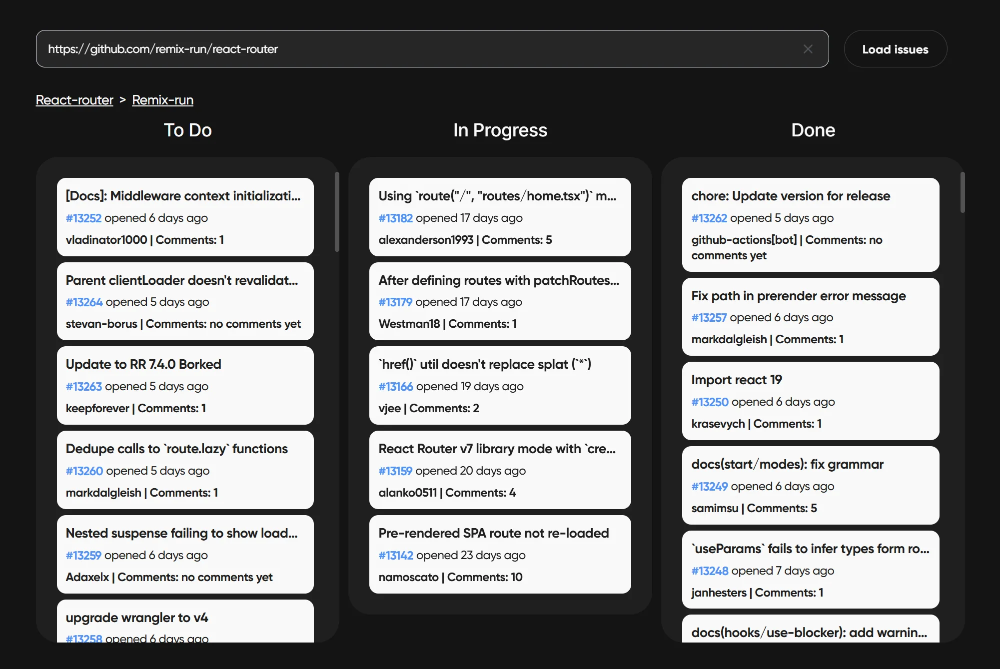

# Kanban Board

This app allows users to load and manage issues from GitHub repositories by
entering the repo URL. Issues are categorized into three columns: **ToDo**,
**InProgress**, and **Done**. You can drag and drop issues between columns to
organize them. Your changes are saved locally in your browser, so even if you
switch repositories or refresh the page, your adjustments will remain intact.



---

## 🛠️ Functionality

- **Enter the Repository URL**:

  - In the input field at the top of the page, enter the GitHub repository URL
    (e.g., `https://github.com/facebook/react`).

- **Load Issues**:

  - Click the **"Load Issues"** button to load issues from the specified
    repository.

- **View and Organize Issues**:

  - Issues will be displayed in three columns:
    - **📝 ToDo**: New issues.
    - **🔨 In Progress**: Open issues with assignees.
    - **✅ Done**: Closed issues.

- **Drag-and-Drop**:

  - Users can drag and drop issues from one column to another to reorganize
    them.

- **State Persistence**:

  - The app stores the issue positions in **Local Storage**. When the user
    switches between repositories or reloads the page, the changes will be
    saved.

- **Profile and Repo Links**:
  - Below the input field, there are links to the repository owner's profile and
    the repository itself.

---

## 📚 About the Project

[**Technical Task**](https://github.com/incodellc/github-kanban-test-task)

---

## ⚙️ Technologies Used


- **@hello-pangea/dnd:** for drag-and-drop functionality
- **Local Storage:** for storing issue positions between sessions
- **ESLint** and **Prettier:** for code quality

---

## 🏁 Getting Started

### 📦 Installation

1. Clone the repository:

   ```bash
   git clone https://github.com/your-username/github-issues-dashboard.git

   ```

2. Install dependencies:

   ```bash
   npm install
   ```

3. Run the app locally:

   ```bash
   npm run dev
   ```

---

## 🧪 Testing

The project includes unit tests to ensure reliability and stability.

### 🚀 Running Tests

To run the test suite, use the following command:

```bash
npm test
```

### 🛠️ Testing Tools


- **@testing-library/jest-dom** – provides additional matchers for testing the
  DOM.
- **MSW (Mock Service Worker)** – used to mock API requests.

### 🔍 What is Tested?

✔ **Component Rendering** – Ensuring that UI components render correctly.

✔ **User Interactions** – Simulating events like clicks, drags, and inputs.

✔ **API Calls** – Mocking GitHub API requests and verifying responses.

✔ **State Management** – Testing Redux actions and reducers.

---

Feel free to contribute or provide feedback on how to improve the board. I
welcome any suggestions for future enhancements or features!🎉
